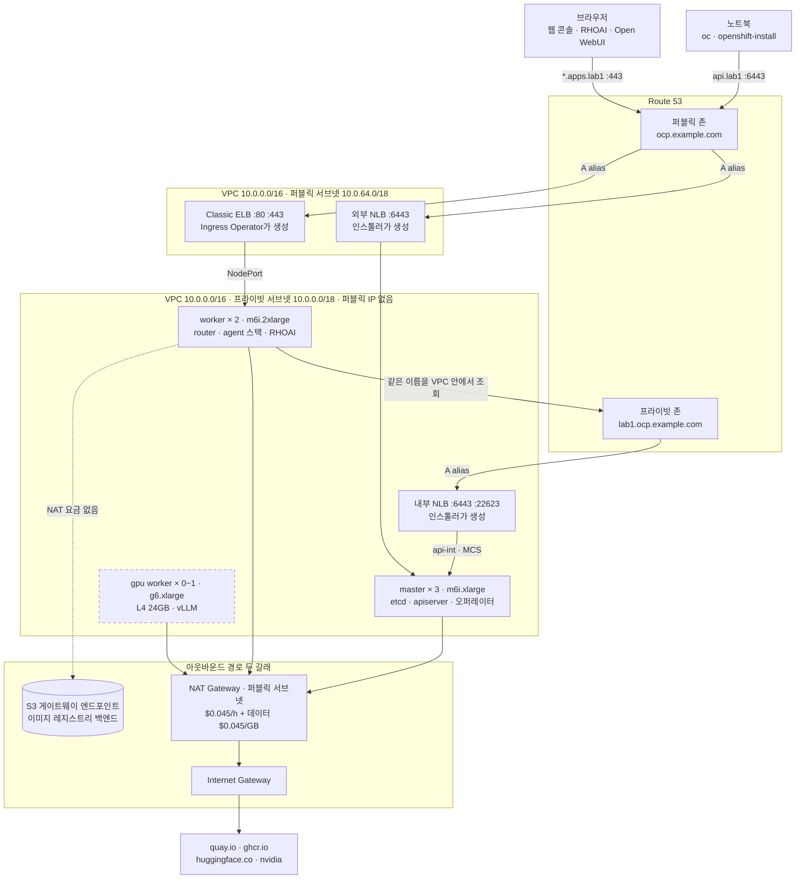
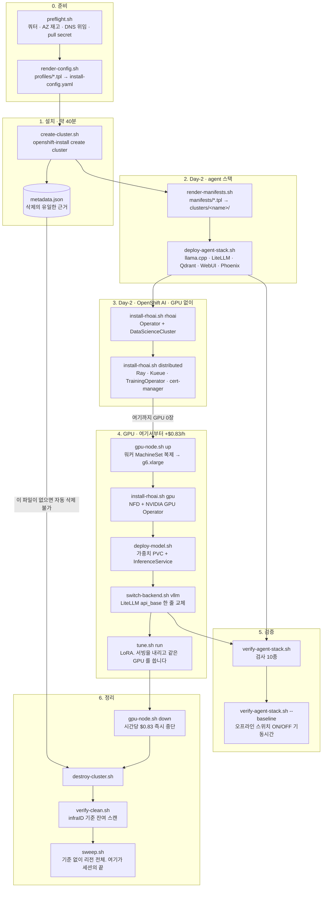
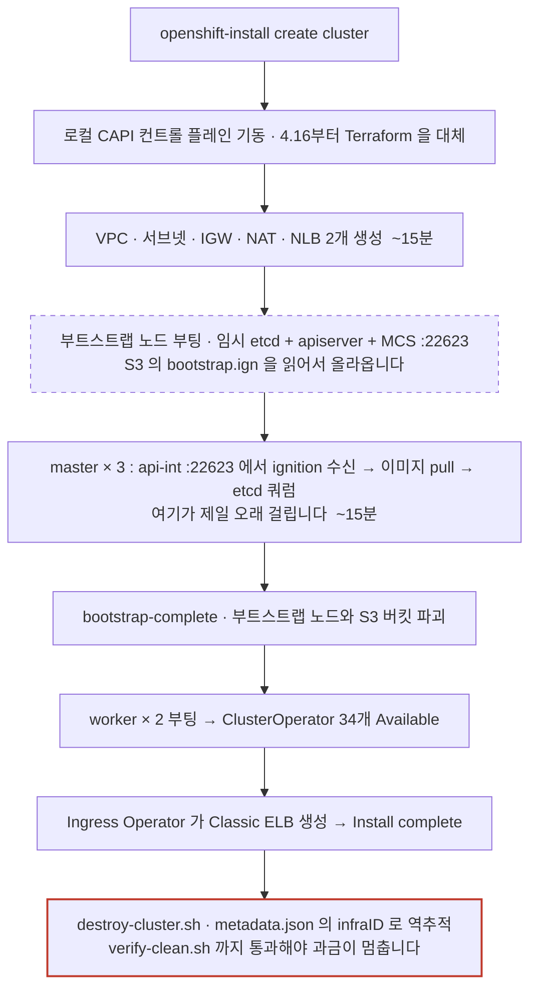
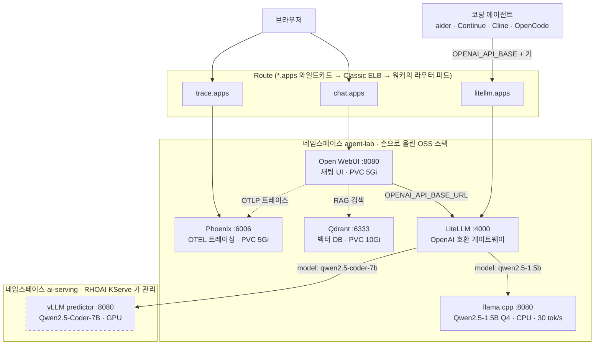
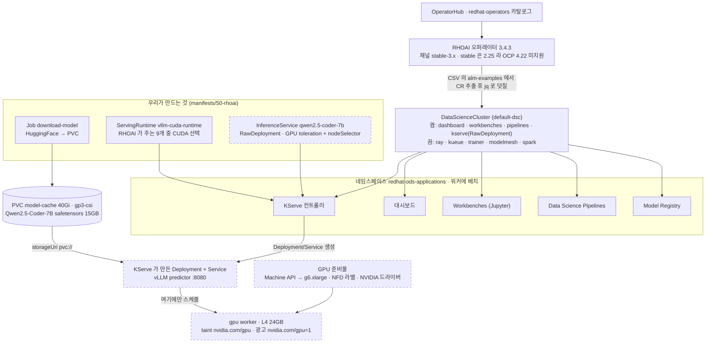

# ocp-aws-lab

AWS 위에 **OpenShift Container Platform(OCP)** 클러스터를 IPI 방식으로 설치하고, 연습이 끝나면 깨끗하게 지우기 위한 실습 레포입니다.

> 랩이 셋 있고 **셋 다 AWS 위**에서 돕니다. 차이는 AWS 를 어떻게 쓰느냐입니다.
>
> | 레포 | 설치 | 워크로드 |
> | --- | --- | --- |
> | ocp-aws-lab | IPI, 클라우드 통합 켬 | AI (agent 스택 + RHOAI) |
> | [ocp-airgap-lab](../ocp-airgap-lab) | UPI, 통합 봉인 | AI (같은 스택, 인터넷 없이) |
> | [ocp-data-lab](../ocp-data-lab) | IPI, 클라우드 통합 켬 | 데이터 (Kafka, Spark, Trino) |

목표는 네 가지입니다.

1. `openshift-install` 기반 설치를 **반복 가능하게** 만든다
2. 연습용으로 **가장 저렴한 구성**을 기본값으로 둔다
3. 지우는 걸 잊어서 **요금 폭탄을 맞지 않는다**
4. 그 위에 **agent 스택과 Red Hat OpenShift AI**를 올려 Day-2를 실제로 해 본다

> ⚠️ 이 레포의 구성은 **학습·평가 전용**입니다. 프로덕션 용도로 그대로 쓰지 마세요. 단일 AZ, 최소 노드, 최소 스토리지로 되어 있어 가용성 보장이 없습니다.

---

## 목차

- [구조 다이어그램](#구조-다이어그램)
- [리전 선택](#리전-선택)
- [사전 준비](#사전-준비)
- [빠른 시작](#빠른-시작)
- [프로파일](#프로파일)
- [agent 스택과 OpenShift AI](#agent-스택과-openshift-ai)
- [비용](#비용)
- [클러스터 삭제 (중요)](#클러스터-삭제-중요)
- [라이선스 / 구독](#라이선스--구독)
- [트러블슈팅](#트러블슈팅)
- [디렉토리 구조](#디렉토리-구조)
- [참고 링크](#참고-링크)

---

## 구조 다이어그램

### 전체 아키텍처

`ai` 프로파일 기준입니다.
`minimal`과 다른 건 워커 크기와 GPU 노드 유무뿐이고, 나머지 구조는 모든 프로파일이 같습니다.



**`api.<cluster>.<baseDomain>`이 조회 위치에 따라 다른 곳을 가리킵니다.**
VPC 밖에서는 퍼블릭 존이 답해 외부 NLB로 가고, VPC 안에서는 프라이빗 존이 답해 내부 NLB로 갑니다.
같은 이름인데 목적지가 다릅니다.
그림에서 `PUB`과 `PRIV` 두 갈래가 그것입니다.

**로드밸런서 3개 중 하나는 인스톨러가 만든 게 아닙니다.**
NLB 2개는 설치 과정에서 생기지만, `*.apps`가 물린 Classic ELB는 설치가 끝난 뒤 Ingress Operator가 Service type=LoadBalancer로 만듭니다.
`verify-clean.sh`가 Classic ELB를 별도로 검사하는 이유입니다.

**아웃바운드 경로가 두 개입니다.**
일반 트래픽은 NAT Gateway를 타지만, S3 행 트래픽은 게이트웨이 VPC 엔드포인트로 빠져서 NAT 데이터 요금($0.045/GB)을 내지 않습니다.
그림의 점선이 그 우회로입니다.

**GPU 노드만 점선입니다.**
설치에 포함되지 않고 `gpu-node.sh`로 붙였다 뗍니다.
나머지는 클러스터가 사는 동안 계속 있습니다.

**과금 대상은 네 가지뿐입니다.**
EC2, NAT Gateway, 로드밸런서, EBS입니다.
VPC, 서브넷, IGW, 라우트 테이블, 보안그룹, IAM 롤은 개수가 많아도 전부 무료입니다.

### 스크립트 파이프라인

레포의 스크립트가 각각 어느 단계를 담당하는지입니다.



`setup-budget.sh`는 최초 1회만 돌리면 되므로 위 흐름에 없습니다.

### 설치 라이프사이클

`create-cluster.sh`가 40분 동안 무엇을 하는지입니다.
로그가 `Waiting for...`에서 오래 멈춰 있을 때 지금 어디쯤인지 알려면 이 그림을 보세요.



**부트스트랩은 일회용 컨트롤 플레인입니다.**
자기 안에 임시 etcd와 apiserver를 띄우고, 동시에 `:22623`(Machine Config Server)으로 마스터들에게 나눠줄 ignition을 서빙합니다.
마스터 3대가 스스로 설 수 있게 되면 파괴됩니다.
그림에서 점선인 둘이 설치 중에만 존재하는 것입니다.

진행 상황은 로드밸런서 타깃 헬스로 확인하는 게 로그보다 정확합니다.

```bash
source scripts/env.sh
for tg in $(aws elbv2 describe-target-groups --query 'TargetGroups[].TargetGroupArn' --output text); do
  aws elbv2 describe-target-health --target-group-arn "$tg" \
    --query 'TargetHealthDescriptions[].[Target.Id,TargetHealth.State]' --output text
done
```

부트스트랩만 `healthy`이고 마스터가 전부 `unhealthy.draining`이면 위 그림의 **이미지 pull 단계**입니다.
마스터가 하나씩 `healthy`로 바뀌면 곧 `bootstrap-complete`으로 넘어갑니다.

### 상세 다이어그램 (Excalidraw)

`minimal` 프로파일로 실제 설치했던 클러스터(`lab1-k6s9t`)를 그린 것입니다.
모든 리소스 ID, CIDR, 포트는 CloudTrail과 설치 로그에서 뽑은 실측값입니다.

| 다이어그램 | 무엇을 보여주나 |
| --- | --- |
| [인프라 배치](https://app.excalidraw.com/s/AU3bkHPBsIE/8sxxVui6XVZ) | VPC, 서브넷, 노드, 로드밸런서, Route 53이 어디에 놓이는지 |
| [트래픽 경로](https://app.excalidraw.com/s/AU3bkHPBsIE/4Gq0Sr9Nsfe) | `oc` 호출, 웹 콘솔, 내부 통신, 아웃바운드 네 갈래 |
| [OCP 논리 구조](https://app.excalidraw.com/s/AU3bkHPBsIE/ApRyIg8PYAP) | AWS를 걷어낸 컨트롤 플레인, 워커, 네트워크 3계층, Machine API |
| [설치·삭제 라이프사이클](https://app.excalidraw.com/s/AU3bkHPBsIE/1FzEkpAa0dX) | 46분 동안 무슨 순서로 생기고 어떻게 사라지는지 |
| [AWS 리소스 전체 인벤토리](https://app.excalidraw.com/s/AU3bkHPBsIE/60CwgVQ29If) | 생성되는 리소스 전부와 과금 대상 구분 |

> 다이어그램은 `lab1-k6s9t` 스냅샷입니다.
> destroy 후 재설치하면 구조는 같지만 리소스 ID는 전부 바뀝니다.
> **링크는 Excalidraw 워크스페이스 권한이 필요합니다.**
> 권한이 없으면 위의 mermaid 로 보세요. 그쪽이 항상 최신입니다.

클러스터 안쪽 구성은 [agent 스택과 OpenShift AI](#agent-스택과-openshift-ai)에 따로 있습니다.

---

## 리전 선택

**하나로 정하지 마세요. 무엇을 연습하느냐에 따라 답이 다릅니다.**

서울에서 측정한 값입니다.

| | us-east-1 | ap-northeast-2 |
| --- | --- | --- |
| TCP connect RTT (서울에서) | **199 ms** | **30 ms** |
| m6i.xlarge | $0.192 | $0.236 (+22.9%) |
| m6i.2xlarge | $0.384 | $0.472 (+22.9%) |
| g6.xlarge (L4 24GB) | $0.8048 | $0.9896 (+23.0%) |
| gp3 (GB-월) | $0.080 | $0.0912 (+14%) |
| g6 가용 AZ | a, b, c, d, f (5개) | a, c, d (3개, **2b 없음**) |

판단은 이렇게 갈립니다.

**설치·삭제 절차 연습이면 `us-east-1`이 맞습니다.**
`openshift-install`은 40분 동안 폴링만 하고, `oc`는 명령 하나에 왕복 한 번입니다.
199ms가 체감되지 않는 작업이고, 20% 싸고, AZ 재고도 넉넉합니다.

**콘솔이나 RHOAI 대시보드를 오래 만질 거면 `ap-northeast-2`가 맞습니다.**
OpenShift 웹 콘솔, RHOAI 대시보드, Jupyter 워크벤치는 클릭 한 번에 여러 번 왕복하는 SPA입니다.
199ms와 30ms의 차이가 매 조작에 곱해집니다.

비용 차이는 생각보다 작습니다.
`ai` 프로파일 + GPU 1대를 5시간 돌릴 때 서울이 약 **$2.5** 더 나옵니다.
6.6배 빠른 반응 속도의 값으로는 싼 편입니다.

> `.env`의 `REGION`과 `AZ`는 짝입니다. 둘 다 바꿔야 합니다.
> 그리고 **단일 AZ로 설치하기 때문에 설치 후에는 AZ를 못 바꿉니다.**
> GPU를 쓸 계획이면 그 AZ에 g6가 있는지 `preflight.sh`가 먼저 확인합니다.

---

## 사전 준비

### 1. AWS

| 항목 | 내용 |
| --- | --- |
| IAM 권한 | IPI 설치는 광범위한 권한이 필요합니다. 학습용 계정에서 `AdministratorAccess`로 시작하고, 익숙해지면 최소 권한으로 좁히세요 |
| Route 53 | **퍼블릭 호스팅 존이 반드시 필요합니다.** 도메인이 없으면 설치가 진행되지 않습니다 |
| vCPU 쿼터 | 프로파일별 설치 피크: `sno` 12, `minimal` 20, `compact`/`default` 28, `ai` 32 (부트스트랩 4 포함). Service Quotas의 `Running On-Demand Standard (A, C, D, H, I, M, R, T, Z) instances`(`L-1216C47A`)가 이보다 커야 합니다 |
| GPU vCPU 쿼터 | **일반 vCPU와 완전히 별개입니다.** `Running On-Demand G and VT instances`(`L-DB2E81BA`). g6.xlarge 1대면 4가 필요합니다. 신규 계정은 이 값이 0인 경우가 있고, 상향 승인에 하루 이상 걸립니다 |
| Elastic IP | 기본 쿼터 5개. 단일 AZ면 문제없지만 멀티 AZ + 다른 리소스가 있으면 부족할 수 있습니다 |
| 리전 | [리전 선택](#리전-선택) 참고. 하나로 정할 문제가 아닙니다 |

쿼터 확인:

```bash
# 일반 인스턴스
aws service-quotas get-service-quota \
  --service-code ec2 --quota-code L-1216C47A --region $REGION

# GPU (G/VT). ai 프로파일을 쓸 거면 이것도 봐야 합니다
aws service-quotas get-service-quota \
  --service-code ec2 --quota-code L-DB2E81BA --region $REGION
```

`preflight.sh`가 둘 다 자동으로 확인합니다.

### 2. Red Hat

- Red Hat 계정 생성
- [60일 self-supported 평가판](https://www.redhat.com/en/technologies/cloud-computing/openshift/ocp-self-managed-trial) 신청 (무료)
- [console.redhat.com](https://console.redhat.com/openshift/install/aws/installer-provisioned)에서 **pull secret** 다운로드

> pull secret은 절대 커밋하지 마세요. `.gitignore`에 이미 포함되어 있습니다.

### 3. 로컬 CLI

바이너리는 시스템 전역이 아니라 레포의 `bin/`에 둡니다.
버전이 섞이면 디버깅이 어려워지고, `bin/`은 gitignore 되어 있어 정리도 쉽습니다.
스크립트들은 `bin/`을 `PATH` 앞에 붙입니다.

```bash
# macOS Apple Silicon
CHANNEL=stable-4.22
BASE=https://mirror.openshift.com/pub/openshift-v4/clients/ocp/${CHANNEL}
mkdir -p bin
curl -fL ${BASE}/openshift-install-mac-arm64.tar.gz | tar xz -C bin openshift-install
curl -fL ${BASE}/openshift-client-mac-arm64.tar.gz  | tar xz -C bin oc kubectl
xattr -dr com.apple.quarantine bin/    # Gatekeeper 격리 해제
chmod +x bin/*

./bin/openshift-install version
```

다른 플랫폼이면 파일명만 바꾸면 됩니다.
`openshift-install-linux.tar.gz`(Linux x86_64), `openshift-install-mac.tar.gz`(Intel Mac).

`openshift-install version`이 출력하는 `release architecture: amd64`는 설치될 클러스터 노드의 아키텍처입니다.
Apple Silicon에서 실행해도 정상입니다.

---

## 빠른 시작

```bash
# 1. 설정
cp .env.example .env
vi .env                          # BASE_DOMAIN, CLUSTER_NAME, REGION 등

# 2. pull secret 배치
cp ~/Downloads/pull-secret.txt secrets/pull-secret.json

# 3. 사전 점검 (여기서 걸리는 건 전부 설치 30분 뒤에 터질 것들입니다)
./scripts/setup-budget.sh        # 최초 1회
./scripts/preflight.sh minimal

# 4. install-config 생성 (프로파일 선택)
./scripts/render-config.sh minimal

# 5. 설치 (약 35~45분)
./scripts/create-cluster.sh

# 6. 접속
export KUBECONFIG=$(pwd)/clusters/$CLUSTER_NAME/auth/kubeconfig
oc get nodes
oc get co                        # ClusterOperator 전부 Available=True 확인

# 7. ⚠️ 연습이 끝나면 반드시
./scripts/destroy-cluster.sh
```

클러스터 위에 뭔가를 올려보려면 [agent 스택과 OpenShift AI](#agent-스택과-openshift-ai)로 이어집니다.
그쪽은 `PROFILE=ai`가 필요합니다.

---

## 프로파일

`profiles/` 아래에 용도별 `install-config` 템플릿이 있습니다.

| 프로파일 | 구성 | 시간당 (us-east-1) | 용도 |
| --- | --- | --- | --- |
| `minimal` | 마스터 3 × m6i.xlarge + 워커 2 × m6i.large, **단일 AZ** | ~$0.95 | 설치 절차 연습, 기본값 |
| `compact` | 마스터 3 × m6i.2xlarge, 워커 0 (마스터 schedulable) | ~$1.30 | 워커 없이 워크로드까지 올려볼 때 |
| `sno` | 단일 노드 1 × m6i.2xlarge | ~$0.55 | 가장 저렴, 엣지/SNO 학습 |
| `default` | 마스터 3 + 워커 3, 3 AZ (설치 프로그램 기본값) | ~$1.35 | 프로덕션에 가까운 구성 체험 |
| `ai` | 마스터 3 × m6i.xlarge + 워커 2 × **m6i.2xlarge**, 단일 AZ | ~$1.54 | agent 스택 + RHOAI. GPU는 설치 후 별도 |

`ai`의 워커가 큰 이유는 취향이 아니라 요구사항입니다.
RHOAI는 워커 노드당 8 CPU / 32 GiB를 기준선으로 요구하는데, `minimal`의 `m6i.large`는 2 vCPU / 8 GiB로 그 1/4입니다.
OCP 모니터링 스택만으로 이미 5~6GB를 쓰기 때문에, `minimal`에서는 RHOAI 대시보드 파드조차 스케줄되지 않습니다.

### `minimal` install-config 예시

```yaml
apiVersion: v1
baseDomain: ${BASE_DOMAIN}
metadata:
  name: ${CLUSTER_NAME}
controlPlane:
  name: master
  replicas: 3
  platform:
    aws:
      type: m6i.xlarge
      zones:
        - ${REGION}a          # 단일 AZ → NAT Gateway 3개 → 1개
      rootVolume:
        size: 120
        type: gp3
compute:
  - name: worker
    replicas: 2
    platform:
      aws:
        type: m6i.large
        zones:
          - ${REGION}a
        rootVolume:
          size: 120
          type: gp3
networking:
  networkType: OVNKubernetes
  clusterNetwork:
    - cidr: 10.128.0.0/14
      hostPrefix: 23
  machineNetwork:
    - cidr: 10.0.0.0/16
  serviceNetwork:
    - 172.30.0.0/16
platform:
  aws:
    region: ${REGION}
    userTags:
      Owner: ${OWNER}
      Purpose: lab
      AutoDelete: "true"       # 정리 스크립트/Lambda가 이 태그를 봄
pullSecret: '${PULL_SECRET}'
sshKey: '${SSH_PUBLIC_KEY}'
```

---

## agent 스택과 OpenShift AI

설치 절차를 익혔으면 그 위에 뭔가를 올려볼 차례입니다.
이 레포는 두 가지를 올립니다. **같은 문제를 다른 고도에서 푸는 것**이라 나란히 놓을 때 의미가 생깁니다.

| | agent 스택 (OSS) | Red Hat OpenShift AI |
| --- | --- | --- |
| 추론 | llama.cpp, CPU, GGUF | KServe + vLLM, GPU, safetensors |
| 배포 단위 | Deployment 5개. 파드 스펙을 우리가 다 씀 | Operator + `DataScienceCluster` CR |
| 가중치 반입 | initContainer가 런타임에 다운로드 | PVC + KServe 스토리지 이니셜라이저 |
| 게이트웨이 | LiteLLM | InferenceService 엔드포인트 |
| 문제가 생기면 볼 곳 | 파드 로그 | 오퍼레이터 컨트롤러 로그 |
| 시간당 추가 비용 | $0 (기존 워커에 얹힘) | +$0.83 (GPU 노드 1대) |

**손으로 올린 쪽을 먼저 하는 걸 권합니다.**
RHOAI는 오퍼레이터가 다 해 주기 때문에 배우는 게 적습니다.
직접 올려 본 스택이 있어야 RHOAI가 무엇을 대신해 주는지 보입니다.

### 구성

전체를 한 장에 넣으면 읽을 수 없어서 두 장으로 나눴습니다.
첫 장은 **요청이 어디로 흐르는가**, 둘째 장은 **누가 무엇을 만들고 어디서 도는가** 입니다.

#### 1. 호출 경로



**LiteLLM에서 나가는 화살표 두 개가 이 랩의 요점입니다.**
같은 게이트웨이가 `model` 이름에 따라 CPU의 1.5B와 GPU의 Coder-7B로 갈라집니다.
Open WebUI는 드롭다운에서 고르고, 코딩 에이전트는 설정 파일에서 고릅니다.
**둘 다 자기가 어느 하드웨어와 이야기하는지 모릅니다.**

`litellm.apps` Route가 코딩 에이전트용 입구입니다.
LiteLLM이 OpenAI 호환이라 `base_url`과 키만 받는 도구는 전부 그대로 꽂힙니다.

```bash
export OPENAI_API_BASE=https://litellm.apps.<cluster>.<domain>/v1
export OPENAI_API_KEY=sk-agent-lab
aider --model openai/qwen2.5-coder-7b
```

Windsurf와 Cursor는 인덱싱과 일부 추론을 자기네 클라우드에서 하므로 `base_url`을 바꿔도 반쪽만 동작합니다.
폐쇄망에서 첫 번째로 걸리는 함정입니다.

점선은 GPU가 있을 때만 존재합니다.

#### 2. 플랫폼과 소유 관계



**`우리가 만드는 것`은 셋뿐입니다.**
나머지는 오퍼레이터가 만듭니다.
`InferenceService`를 하나 넣으면 KServe 컨트롤러가 Deployment와 Service를 대신 만듭니다.
그래서 문제가 생겼을 때 볼 곳이 파드가 아니라 **컨트롤러 로그**입니다.
직접 올린 agent 스택과 정확히 반대입니다.

세 가지가 실제로 발목을 잡았습니다.

- **채널**: `stable`은 RHOAI 2.25이고 OCP 4.22를 지원하지 않습니다. `defaultChannel`인 `stable-3.x`가 3.4.3을 줍니다. 문서 대부분이 `stable`이라고 적혀 있어서 하드코딩하면 미지원 조합이 깔립니다
- **ServingRuntime**: RHOAI 3.4는 vLLM 런타임을 가속기별로 **9개** 냅니다. 전부 `supportedModelFormats`에 `vLLM`을 갖고 있어 조건만으로는 구분이 안 됩니다. 알파벳순으로 집으면 `vllm-cpu-runtime`이 걸려서 **GPU 위에서 CPU 추론**을 하게 됩니다
- **컴포넌트 이름**: 3.x에서 `trainer`가 새로 생겼고 기본이 `Managed`입니다. JobSet 오퍼레이터를 요구해서 `DataScienceCluster`가 계속 `Not Ready`였습니다

이래서 CR과 채널을 레포에 박지 않고 클러스터에서 꺼내 씁니다.

### 실행 순서

```bash
# 0. ai 프로파일로 설치 (기존 클러스터가 minimal이면 재설치가 필요합니다)
vi .env                              # PROFILE=ai
./scripts/preflight.sh ai
./scripts/render-config.sh ai
./scripts/create-cluster.sh

source scripts/env.sh

# 1. agent 스택. GPU 없이 돕니다
./scripts/render-manifests.sh
./scripts/deploy-agent-stack.sh
./scripts/verify-agent-stack.sh

# 2. RHOAI 오퍼레이터. 이것도 GPU 없이 됩니다
./scripts/install-rhoai.sh rhoai     # Operator + DataScienceCluster (~30분)
# 대시보드 / 워크벤치 / 파이프라인은 여기까지만 해도 다 돌아갑니다

# 2-1. 학습/분산 컴포넌트. 이것도 GPU 없이 됩니다
./scripts/install-rhoai.sh distributed   # Ray + Kueue + TrainingOperator + cert-manager

# 3. GPU. 여기서부터 시간당 $0.83이 더 나갑니다
./scripts/gpu-node.sh up 1
./scripts/install-rhoai.sh gpu       # NFD + NVIDIA GPU Operator (10~20분)
./scripts/deploy-model.sh            # 가중치 다운로드 + InferenceService

# 4. 백엔드 전환. Open WebUI는 그대로 두고 llama.cpp -> vLLM
./scripts/switch-backend.sh vllm
./scripts/verify-agent-stack.sh 3

# 5. LoRA 파인튜닝. 서빙을 내리고 GPU를 씁니다
./scripts/tune.sh run
./scripts/tune.sh logs
./scripts/tune.sh restore            # 서빙 복구. 자동으로 안 돌아옵니다

# 6. GPU만 반납. 클러스터는 그대로 두고 시간당 $0.83을 멈춥니다
./scripts/gpu-node.sh down
```

**2번과 3번의 순서가 중요합니다.**
RHOAI 오퍼레이터 설치는 GPU를 전혀 쓰지 않습니다.
GPU를 먼저 올려두고 RHOAI를 깔면 그 30분이 시간당 $0.83으로 계산됩니다.
GPU가 실제로 필요한 건 vLLM `InferenceService` 하나뿐이므로, 그 직전에 올리고 끝나면 바로 내리세요.
이 순서 하나로 세션당 $0.4 정도가 차이납니다.

각 단계는 독립적으로 다시 돌릴 수 있습니다.
`install-rhoai.sh`는 이미 설치된 오퍼레이터를 건드리지 않고, `gpu-node.sh up`은 이미 있는 MachineSet을 확장만 합니다.

### 왜 CR을 레포에 박아두지 않았나

`DataScienceCluster`, `ClusterPolicy`, `NodeFeatureDiscovery`는 오퍼레이터 버전마다 필드가 바뀝니다.
문서를 보고 베껴 둔 YAML은 반년이면 틀립니다.

그래서 `install-rhoai.sh`는 **설치된 CSV의 `alm-examples`에서 그 버전의 정답을 꺼내 쓰고**, 우리가 실제로 다르게 하고 싶은 부분만 `jq`로 덧칠합니다.
덧칠 대상 경로가 없으면 조용히 넘어가지 않고 경고를 냅니다.
그게 "이 버전에서 뭔가 바뀌었다"는 신호이기 때문입니다.

Subscription의 채널도 하드코딩하지 않고 `packagemanifest`에서 읽습니다.

### 기준선 측정

이 랩에서 실제로 얻어갈 숫자는 기동 시간입니다.

```bash
./scripts/verify-agent-stack.sh --baseline
```

Open WebUI를 오프라인 스위치 ON/OFF 두 설정으로 각각 재기동해서 `PodScheduled -> Ready` 시간을 잽니다.

인터넷이 있는 여기서는 차이가 얼마 안 납니다.
HuggingFace도 GitHub도 응답하니까요.
같은 매니페스트를 폐쇄망에 올리면 그 호출들이 **실패가 아니라 타임아웃까지 대기**로 바뀌고, 차이가 수십 초에서 분 단위로 벌어집니다.
그게 폐쇄망에서 "왜 이렇게 느리냐"는 티켓의 정체입니다.

### ocp-airgap-lab과의 관계

[ocp-airgap-lab](../ocp-airgap-lab)은 AWS 위에 고객사 폐쇄망을 재현하고 같은 스택을 올립니다.

이쪽 `manifests/**/*.yaml.tpl`은 이미지 경로와 StorageClass, 오프라인 스위치를 전부 변수로 빼 두었습니다.
**목표는 두 레포의 템플릿을 바이트 단위로 같게 두고, 차이를 `.env`에만 두는 것입니다.**

> 현재 `ocp-airgap-lab` 쪽은 아직 미러 경로를 하드코딩하고 있습니다.
> 같은 변수 이름으로 맞추는 작업이 남아 있고, 그 전까지 두 레포의 템플릿은 다릅니다.

| 변수 | 여기 | ocp-airgap-lab |
| --- | --- | --- |
| `IMAGE_*` | `ghcr.io/...`, `docker.io/...` | `registry.lab.internal:8443/...` |
| `STORAGE_CLASS` | `gp3-csi` (IPI 기본) | `nfs` (직접 만들어야 함) |
| `AGENT_OFFLINE` | `false` | `true` |

`verify-agent-stack.sh`의 7번 검사는 두 레포에서 **기대값이 정반대**입니다.
여기서는 파드가 `quay.io`에 닿아야 통과이고, 거기서는 닿지 않아야 통과입니다.

---

## 비용

### 구성 요소별 (us-east-1 온디맨드, `minimal` 프로파일)

| 항목 | 수량 | 시간당 |
| --- | --- | --- |
| 컨트롤 플레인 m6i.xlarge | 3 | $0.576 |
| 워커 m6i.large | 2 | $0.192 |
| EBS gp3 120GB × 5 | 600GB | $0.066 |
| NAT Gateway (단일 AZ) | 1 | $0.045 |
| NLB (external + internal) | 2 | $0.045 |
| Classic ELB (`*.apps`) | 1 | $0.025 |
| **합계** | | **≈ $0.95 / 시간** |

부트스트랩 노드와 데이터 전송은 시간당이 아니라 별도입니다. 아래 표를 보세요.

### `ai` 프로파일 (us-east-1)

| 항목 | 수량 | 시간당 |
| --- | --- | --- |
| 컨트롤 플레인 m6i.xlarge | 3 | $0.576 |
| 워커 m6i.2xlarge | 2 | $0.768 |
| EBS gp3 (마스터 120GB × 3 + 워커 200GB × 2) | 760GB | $0.083 |
| NAT Gateway (단일 AZ) | 1 | $0.045 |
| NLB (external + internal) | 2 | $0.045 |
| Classic ELB (`*.apps`, Ingress Operator가 생성) | 1 | $0.025 |
| **소계** | | **≈ $1.54 / 시간** |
| GPU 워커 g6.xlarge (L4 24GB) + EBS 200GB | 1 | **+$0.83 / 시간** |
| **GPU 포함 합계** | | **≈ $2.37 / 시간** |

위 단가는 전부 AWS Pricing API 조회값입니다.
시간당 요금 외에 **한 번만 나가는 것**과 **데이터 전송**이 따로 있습니다.

| 항목 | 금액 | 비고 |
| --- | --- | --- |
| 부트스트랩 노드 (m6i.xlarge, 설치 중 ~40분) | 일회성 ~$0.14 | 설치가 끝나면 인스톨러가 지웁니다 |
| NAT 데이터 전송 | $0.045/GB | 이미지 pull 이 전부 여기를 지납니다 |
| 프라이빗 호스팅 존 | $0.50/월 | **생성 후 12시간 안에 지우면 과금되지 않습니다** |

**NAT 데이터 전송이 생각보다 큽니다.**
노드끼리 이미지 캐시를 공유하지 않아서, 5대가 각자 레지스트리에서 받아옵니다.
설치에 20~40GB, agent 스택에 8~12GB, RHOAI 와 GPU 오퍼레이터에 25~35GB 정도가 지나갑니다.
세션 하나에 **$1.5~$3** 가 데이터 전송으로 나간다고 보면 됩니다.

S3 로 가는 트래픽(부트스트랩 ignition, 내부 레지스트리 백엔드)은 게이트웨이 엔드포인트로 빠져서 이 요금을 내지 않습니다.

GPU는 `gpu-node.sh down`으로 언제든 반납할 수 있습니다.
EC2와 EBS가 사라지므로 그 순간부터 $0.83이 멈추고, 클러스터는 그대로 살아 있습니다.
모델 서빙을 실제로 할 때만 붙이세요.

### 시나리오별 예상 금액

| 시나리오 | 비용 |
| --- | --- |
| `minimal` 설치 1회 + 4시간 실습 + 삭제 | **약 $6** |
| `ai` 설치 1회 + 5시간 (GPU는 그중 2시간) + 삭제 | **약 $12** |
| `minimal` 하루 8시간 × 5일 (매일 삭제) | **약 $40** |
| `ai` + GPU를 삭제 잊고 한 달 방치 | **약 $1,700** 😱 |

서울 리전(`ap-northeast-2`)은 위 금액에서 **약 20% 추가**됩니다.
EC2 단가가 정확히 +22.9%, gp3가 +14%입니다.

> 위 단가는 2026년 8월 기준 참고값입니다. 실제 청구액은
> [AWS Pricing Calculator](https://calculator.aws/)와 Cost Explorer로 확인하세요.

### 비용을 줄이는 방법

- ✅ **단일 AZ 사용** — NAT Gateway 3개 → 1개 (월 $65 절약)
- ✅ **워커 노드 최소화** — 설치 절차 연습이 목적이면 `m6i.large` 2대로 충분
- ✅ **루트 볼륨 120GB 유지** — 기본값 이상으로 키우지 않기
- ✅ **`us-east-1` 사용** — 서울 대비 20% 저렴. 단 [리전 선택](#리전-선택)의 트레이드오프를 먼저 보세요
- ✅ **GPU는 쓸 때만 붙이기** — `gpu-node.sh down`. 클러스터는 살려두고 시간당 $0.83만 끕니다
- ❌ **EC2 stop만 하고 방치하지 않기** — NAT Gateway, NLB, EBS, EIP는 계속 과금됩니다
- ❌ **io1/io2 볼륨 쓰지 않기** — gp3 대비 몇 배 비쌉니다

---

## 클러스터 삭제 (중요)

**이 레포에서 가장 중요한 부분입니다.**

```bash
./scripts/destroy-cluster.sh
# 내부적으로: openshift-install destroy cluster --dir=clusters/$CLUSTER_NAME
```

`destroy`는 설치 시 생성된 메타데이터(`metadata.json`)를 기준으로 리소스를 찾습니다.
**`clusters/<name>/` 디렉토리를 지우면 자동 삭제가 불가능해집니다.** 반드시 보관하세요.

### 삭제 후 확인 체크리스트

```bash
./scripts/verify-clean.sh        # 이 클러스터가 깨끗이 지워졌나 (infraID 기준)
./scripts/sweep.sh               # 리전에 돈 나가는 게 남았나 (기준 없음)
```

두 스크립트는 보는 게 다릅니다.

| | 기준 | 무엇을 답하나 |
| --- | --- | --- |
| `verify-clean.sh` | `infraID` | 이 클러스터의 잔여물이 있나 |
| `sweep.sh` | 없음 | 이 리전에 과금 리소스가 뭐가 있나 |

**반복 실습에서는 `sweep.sh` 가 실질적인 안전장치입니다.**
설치가 중간에 깨져 `metadata.json` 이 안 생긴 세대나, `clusters/` 를 지워 `infraID` 를 잃은 세대는 `verify-clean.sh` 로 안 잡힙니다.
`sweep.sh` 는 EC2, NAT, 로드밸런서, EBS(붙은 것과 고아 둘 다), Elastic IP, 프라이빗 존, S3 를 전부 나열하고 **시간당 합계**를 냅니다.

```text
현재 시간당 약 $1.5423  (하루 $37.02 · 한 달 $1126)
```

`과금 리소스 없음` 이 나와야 세션이 끝난 것입니다.
`--all` 을 주면 모든 리전을 훑습니다. 리전을 바꿔가며 실습했다면 한 번 돌려 보세요.

수동으로 확인한다면:

```bash
CLUSTER_TAG="kubernetes.io/cluster/${INFRA_ID}"

aws ec2 describe-instances --filters "Name=tag-key,Values=$CLUSTER_TAG" --region $REGION
aws ec2 describe-nat-gateways --region $REGION
aws elbv2 describe-load-balancers --region $REGION
aws elb describe-load-balancers --region $REGION        # Service type=LoadBalancer 흔적
aws ec2 describe-volumes --filters "Name=status,Values=available" --region $REGION
aws ec2 describe-addresses --region $REGION             # 미사용 EIP도 과금됩니다
aws route53 list-resource-record-sets --hosted-zone-id $ZONE_ID

# 아래 세 가지는 자주 누락되지만 실제로 남습니다
aws s3api list-buckets --query "Buckets[?contains(Name,'$INFRA_ID')]"   # 버킷 2종 (아래 참고)
aws route53 list-hosted-zones \
  --query "HostedZones[?Config.PrivateZone==\`true\`]"                  # 프라이빗 존, 개당 월 \$0.50
aws iam list-roles  --query "Roles[?contains(RoleName,'$INFRA_ID')]"    # 과금은 없지만 계정이 지저분해집니다
aws iam list-users  --query "Users[?contains(UserName,'$INFRA_ID')]"    # 4.22 기준 0개. 구버전 대비 방어용
```

S3 버킷은 두 종류가 만들어집니다.
용도가 달라서 남는 이유도 다릅니다.

| 버킷 | 용도 | 언제 사라지나 |
| --- | --- | --- |
| `openshift-bootstrap-data-<infraID>` | 부트스트랩 ignition 전달 | 부트스트랩 완료 시점에 설치 프로그램이 삭제 |
| `<infraID>-image-registry-<region>` | 내부 이미지 레지스트리 백엔드 | `destroy` 때 삭제. 이미지를 push했다면 용량만큼 과금됨 |

설치가 중간에 실패하면 첫 번째 버킷이 남아 재설치를 방해할 수 있습니다.

### 안전장치 권장

우선순위 순서입니다.
1번이 실질적인 방어선이고, 나머지는 보조 수단입니다.

1. **한 세션 안에 끝내기.**
   설치 40분, 실습, 그리고 바로 `destroy`.
   재설치가 40분이면 되므로 stop/start보다 destroy가 항상 깔끔합니다.
2. **실습을 시작하기 전에 destroy 타이머를 먼저 걸기.**
   끝나고 나서 기억해내는 것보다 확실합니다.
3. **`clusters/<name>/metadata.json` 백업.**
   `create-cluster.sh`가 `clusters/_backups/`에 자동으로 복사합니다.
   이 파일이 없으면 자동 삭제가 불가능해집니다.
4. **`Purpose=lab` 태그 + Cost Explorer 필터링.**
5. **AWS Budgets** (`./scripts/setup-budget.sh`).

> Budgets는 **청구 데이터 자체가 8~24시간 지연**됩니다.
> 시간당 $1.5짜리 클러스터를 방치했을 때 알림이 울릴 즈음이면 이미 $30이 나간 뒤입니다.
> 백스톱으로는 두되, 이걸 주 방어선으로 믿지 마세요.

---

## 라이선스 / 구독

OCP 셀프 매니지드는 **유료 구독 제품**입니다(코어/소켓 페어 단위 연간 계약, 정가 비공개).
다만 **학습 목적이라면 무료 경로**가 있습니다.

| 방법 | 비용 | 설치 연습 | 비고 |
| --- | --- | --- | --- |
| **60일 평가판** | 무료 | ✅ | 기능 제한 없음. 이 레포의 기본 전제 |
| **OKD** | 영구 무료 | ✅ | 커뮤니티 업스트림. 절차 거의 동일 |
| Developer Sandbox | 무료 | ❌ | 이미 만들어진 공유 클러스터 |
| OpenShift Local (CRC) | 무료 | ❌ | 로컬 단일 노드 개발용 |
| ROSA | 시간당 과금 | △ | 워커 4 vCPU당 $0.171/h + HCP 클러스터 $0.25/h. `rosa` CLI라 절차가 다름 |

**60일이 지난 뒤에는 OKD로 전환**하는 걸 권장합니다. `openshift-install` 대신 OKD 릴리스의 installer를 쓰는 것 외에 흐름이 거의 같습니다.

> 평가판이든 유료 구독이든 **AWS 인프라 비용은 별도**입니다. 구독은 소프트웨어에 대한 것이지 인프라를 포함하지 않습니다.

### 평가판은 한 번뿐입니다

[제품 트라이얼 페이지](https://www.redhat.com/en/technologies/cloud-computing/openshift/ocp-self-managed-trial)의 `Trial eligibility` 조건입니다.

- Red Hat 계정이 있어야 합니다. 없으면 가입 절차로 넘어갑니다
- 트라이얼 약관에 동의해야 합니다
- **이전에 이 트라이얼을 활성화한 적이 있으면, 마지막 만료일로부터 90일을 기다려야 다시 시작할 수 있습니다**

세 번째가 실습 일정을 좌우합니다.
60일을 다 쓰고 만료되면 그 다음 트라이얼은 **90일 뒤**에나 가능하고, 그 사이를 당기려면 Red Hat Sales를 거쳐야 합니다.
사실상 창이 한 번뿐이라고 보고 계획을 세우는 게 맞습니다.

현재 트라이얼 상태는 [My trials](https://www.redhat.com/en/products/trials/my-trials) 에서 확인합니다.

| 항목 | 값 |
| --- | --- |
| 구독 시작 | 2026-08-15 |
| 만료 예정 | 2026-10-14 전후 (60일) |
| 재활성화 가능 시점 | 만료 후 90일. 대략 2027년 1월 중순 |
| 지원 수준 | self-supported (문서와 Knowledgebase만) |

그래서 RHOAI, GPU, 오퍼레이터 실습처럼 평가판이 필요한 것은 이 기간 안에 몰아서 하고, 그 뒤의 반복 연습은 OKD로 넘기는 게 맞습니다.

> **평가판과 pull secret은 별개입니다.**
> 설치에 필요한 건 `console.redhat.com` 에서 받는 pull secret 이고, 그건 Red Hat 계정만 있으면 나옵니다.
> 평가판은 구독 엔타이틀먼트 쪽이라, 평가판 없이도 설치 자체는 진행됩니다.
> 다만 그건 구독 없이 제품을 쓰는 것이므로 평가판을 받아 두는 게 맞습니다.

---

## 트러블슈팅

<details>
<summary><b><code>openshift-install</code>을 직접 실행했더니 엉뚱한 IAM 유저로 붙음</b></summary>

`openshift-install`은 `.env`를 읽지 않고 AWS SDK의 기본 프로파일을 씁니다.
계정에 다른 프로젝트 IAM 유저가 여럿 있으면 `UnauthorizedOperation`이 나거나, 더 나쁘게는 의도하지 않은 컨텍스트로 동작합니다.

스크립트(`create-cluster.sh`, `destroy-cluster.sh`, `preflight.sh`)를 통해 실행하면 자동으로 처리됩니다.
직접 명령을 칠 때는 먼저 환경을 로드하세요.

```bash
source scripts/env.sh
openshift-install wait-for bootstrap-complete --dir=$CLUSTER_DIR
```

</details>

<details>
<summary><b><code>source scripts/env.sh</code>를 했는데도 엉뚱한 IAM 유저로 붙음 (zsh)</b></summary>

`AWS_PROFILE`이 실제로 잡혔는지 확인하세요.

```bash
source scripts/env.sh
echo "$AWS_PROFILE"
aws sts get-caller-identity --query Arn --output text
```

`ocp-lab` / `...user/ocp-lab-admin`이 나와야 정상입니다.

과거에 이게 **zsh에서 조용히 실패**했습니다.
`lib.sh`가 자기 위치를 `${BASH_SOURCE[0]}`로 찾는데 zsh에는 그 변수가 없습니다.
`REPO_ROOT`가 한 단계 위를 가리키면서 `.env`를 못 찾고, `AWS_PROFILE`이 export되지 않은 채로 넘어갑니다.
그러면 `aws`도 `openshift-install`도 `default` 프로파일로 붙습니다.

스크립트(`./scripts/*.sh`)는 shebang이 bash라 영향이 없었고, **손으로 `source`할 때만** 터졌습니다.
`aws`가 조용히 다른 계정으로 동작하는 종류라 알아차리기 어렵습니다.

지금은 `lib.sh`와 `env.sh`가 zsh의 `${(%):-%x}`를 함께 봅니다.
새 셸을 쓰신다면 위 세 줄로 한 번 확인하세요.
</details>

<details>
<summary><b>설치가 <code>waiting for bootstrap to complete</code>에서 멈춤</b></summary>

```bash
openshift-install wait-for bootstrap-complete --dir=clusters/$CLUSTER_NAME --log-level=debug

# 부트스트랩 노드 로그 수집
openshift-install gather bootstrap --dir=clusters/$CLUSTER_NAME
```

대부분 원인: 보안 그룹, NAT/인터넷 접근 불가, Route 53 레코드 전파 지연, vCPU 쿼터 초과.
</details>

<details>
<summary><b><code>UnauthorizedOperation</code> / IAM 권한 오류</b></summary>

IPI는 IAM 역할·정책을 직접 생성합니다. 권한이 부족하면 중간에 실패합니다.
학습용이면 관리자 권한으로 시작하고, 최소 권한 구성은 Red Hat의 least-privilege 가이드를 참고하세요.
</details>

<details>
<summary><b><code>InsufficientInstanceCapacity</code></b></summary>

해당 AZ에 인스턴스가 없습니다. `zones`를 다른 AZ로 바꾸거나 인스턴스 타입을 변경하세요 (`m6i` → `m5`).
</details>

<details>
<summary><b>며칠 꺼뒀다가 켰더니 노드가 <code>NotReady</code></b></summary>

OCP는 kubelet 클라이언트 인증서를 자동 갱신하는데, 클러스터가 꺼져 있는 동안 갱신이 안 됩니다.

```bash
oc get csr -o name | xargs oc adm certificate approve
```

**24시간 이상 정지는 권장하지 않습니다.** 실습용이라면 stop/start보다 destroy 후 재설치가 훨씬 깔끔하고, 어차피 비용도 비슷합니다.
</details>

<details>
<summary><b>destroy 후에도 리소스가 남아 있음</b></summary>

주로 클러스터가 동적으로 만든 리소스입니다 (Service type=LoadBalancer로 생성된 ELB, PVC로 생성된 EBS 볼륨).
`destroy` 전에 워크로드를 먼저 지우면 예방됩니다. 남았다면 `scripts/verify-clean.sh`로 찾아 수동 삭제하세요.

agent 스택과 RHOAI는 PVC를 여러 개 만듭니다. `destroy-cluster.sh`가 실행 전에 Bound PVC 개수를 세어 경고합니다.
</details>

<details>
<summary><b>GPU 노드는 Ready인데 <code>nvidia.com/gpu</code>가 <code>&lt;none&gt;</code></b></summary>

NVIDIA GPU Operator가 드라이버를 아직 못 올린 것입니다. 드라이버 컨테이너 빌드에 10~20분 걸립니다.

```bash
oc get pods -n nvidia-gpu-operator
oc get clusterpolicy -o jsonpath='{.items[0].status.state}'
```

`nvidia-driver-daemonset`가 `Init` 이나 `CrashLoop`에 머물면 대개 NFD가 노드에 라벨을 안 붙인 것입니다.
GPU Operator는 "어느 노드에 NVIDIA 카드가 있는지"를 스스로 모릅니다.

```bash
oc get nodes -l feature.node.kubernetes.io/pci-10de.present=true
```

비어 있으면 `./scripts/install-rhoai.sh gpu`의 NFD 단계부터 다시 보세요.
</details>

<details>
<summary><b>InferenceService가 계속 <code>Ready=False</code></b></summary>

먼저 파드가 어디에 있는지 봅니다. `Pending`이면 스케줄 문제, `Running`인데 안 되면 vLLM 문제입니다.

```bash
oc get pods -n ai-serving
oc logs -n ai-serving -l serving.kserve.io/inferenceservice=qwen2.5-1.5b --all-containers --tail=50
```

자주 나오는 원인 세 가지입니다.

- **Pending, 이벤트에 `untolerated taint`** — `gpu-node.sh`가 붙인 `nvidia.com/gpu` taint를 InferenceService가 toleration으로 안 받았습니다. 매니페스트에 들어 있으니 렌더링이 최신인지 확인하세요
- **`storage initializer` 컨테이너에서 실패** — PVC에 가중치가 없습니다. `deploy-model.sh`의 다운로드 Job이 완료됐는지 보세요
- **vLLM이 OOM** — `--gpu-memory-utilization` 값을 낮추세요. L4 24GB에 1.5B면 0.55로 충분합니다

</details>

<details>
<summary><b>Open WebUI가 뜨긴 하는데 첫 화면이 오래 걸림</b></summary>

기동할 때 HuggingFace, GitHub, Scarf로 나갑니다. 인터넷이 있으면 성공하고 빨리 끝나지만, egress가 막혀 있으면 타임아웃까지 대기합니다.

`./scripts/verify-agent-stack.sh --baseline`으로 두 설정의 기동 시간을 직접 재 보세요.
폐쇄망에서 "왜 이렇게 느리냐"는 티켓의 정체가 이 숫자입니다.
</details>

<details>
<summary><b>PVC가 조용히 Pending</b></summary>

기본 StorageClass가 없거나 이름이 안 맞습니다.

```bash
oc get sc
oc describe pvc -n agent-lab
```

AWS IPI는 `gp3-csi`가 기본으로 붙습니다. 없다면 EBS CSI Operator 쪽을 보세요.
`.env`의 `STORAGE_CLASS`로 직접 지정할 수도 있습니다.
</details>

<details>
<summary><b>콘솔의 파드 Terminal 탭이 새까맣게 빈 화면</b></summary>

파드 문제가 아닙니다. OCP 4.22.6 콘솔의 렌더링 버그입니다.

Terminal 탭은 처음 열릴 때 xterm을 **1열 1행**으로 잡습니다.
셸은 정상으로 붙고 프롬프트 바이트도 도착하는데, 그릴 자리가 없어서 검은 화면만 보입니다.

**오른쪽 위 `Expand`를 누르거나 브라우저 창 크기를 바꾸면 나옵니다.**

직접 확인한 근거입니다.

```text
콘솔이 보내는 exec 명령을 pty로 재현      -> "(app-root) sh-5.1$ "  정상
브라우저에서 .xterm-screen 크기 측정       -> 19x19 px, 행 1개
resize 이벤트 1회                          -> 1315x567, 27행, 프롬프트 표시
openshift-console 자신의 파드에서도 동일    -> 우리 이미지와 무관
```

애초에 tmux와 neovim을 쓸 자리가 아닙니다. 키 조합이 콘솔에 먹힙니다.
제대로 쓰려면 로컬 터미널에서 들어가세요.

```bash
source scripts/env.sh
oc rsh deploy/coding-agent
```

</details>

<details>
<summary><b>이미지를 다시 빌드했는데 컨테이너 동작이 그대로</b></summary>

`oc rollout restart`는 **같은 spec으로 파드만 다시 만듭니다.**
새 이미지는 받아 오지만 `command`, `args`, `env`는 옛날 것 그대로입니다.

`Containerfile`과 `*.yaml.tpl`을 같이 고쳤다면 매니페스트까지 다시 적용해야 합니다.

```bash
./scripts/render-manifests.sh
oc apply -f clusters/$CLUSTER_NAME/manifests/30-devtools/
```

실제로 이걸 빠뜨려서 `fix-uid` 호출이 빠진 채로 돌았습니다.
증상은 컨테이너 안에서 `whoami`가 실패하는 것이었습니다.
OCP는 임의 UID(`1000730000`)로 컨테이너를 띄우는데 그 UID가 `/etc/passwd`에 없으면 이름을 못 찾습니다.
</details>

---

## 디렉토리 구조

```text
ocp-aws-lab/
├── README.md
├── CLAUDE.md                   # 이 레포에서 작업할 때의 규칙. 기록 의무 포함
├── .env.example
├── .gitignore                  # secrets/, clusters/ 제외
├── profiles/                   # install-config 템플릿
│   ├── minimal.yaml.tpl
│   ├── compact.yaml.tpl
│   ├── sno.yaml.tpl
│   ├── default.yaml.tpl
│   └── ai.yaml.tpl             # agent 스택 + RHOAI 용
├── manifests/                  # 클러스터에 올릴 것들. 번호가 적용 순서
│   ├── 10-model/
│   │   └── llama-cpp.yaml.tpl
│   ├── 20-agent/
│   │   ├── litellm.yaml.tpl
│   │   ├── qdrant.yaml.tpl
│   │   ├── open-webui.yaml.tpl
│   │   └── phoenix.yaml.tpl
│   ├── 30-devtools/            # 클러스터 안 개발 환경
│   │   ├── Containerfile       # nvim · tmux · rg · fd · aider
│   │   └── coding-agent.yaml.tpl
│   ├── 40-langgraph/           # 직접 만든 agent (ReAct + 체크포인터)
│   │   └── langgraph.yaml.tpl
│   ├── 60-pipelines/           # Data Science Pipelines + MinIO
│   │   └── dspa.yaml.tpl
│   ├── 70-console/             # 앱 런처 등록 (ConsoleLink)
│   │   └── consolelinks.yaml.tpl
│   ├── 80-tuning/              # LoRA 파인튜닝 (PyTorchJob)
│   │   └── 10-pytorchjob-lora.yaml.tpl
│   └── 50-rhoai/
│       ├── 10-model-storage.yaml.tpl
│       └── 20-inferenceservice.yaml.tpl
├── bin/                        # gitignored, openshift-install / oc
├── scripts/
│   ├── lib.sh                  # 공통 함수, .env 로더
│   ├── env.sh                  # source 용. 수동 명령 실행 전 환경 로드
│   ├── preflight.sh            # 쿼터/권한/DNS위임/pull secret 사전 점검
│   ├── render-config.sh        # profiles/*.tpl → install-config.yaml
│   ├── create-cluster.sh       # 설치 + metadata.json 자동 백업
│   ├── destroy-cluster.sh
│   ├── verify-clean.sh         # infraID 기준 잔여 리소스 스캔
│   ├── sweep.sh                # 기준 없이 리전 전체 과금 리소스 스캔
│   ├── snapshot.sh             # 지금 세대의 ID·엔드포인트·버전을 마크다운으로
│   ├── setup-budget.sh         # AWS Budgets 알림
│   ├── render-manifests.sh     # manifests/*.tpl → clusters/<name>/manifests/
│   ├── deploy-agent-stack.sh   # agent 스택 배포 + 기동 대기
│   ├── verify-agent-stack.sh   # 검증 7종 + --baseline 기동시간 비교
│   ├── gpu-node.sh             # GPU MachineSet up / down / delete
│   ├── install-rhoai.sh        # NFD + GPU Operator + RHOAI + distributed(Ray/Kueue)
│   ├── deploy-model.sh         # 가중치 다운로드 + InferenceService
│   ├── switch-backend.sh       # LiteLLM api_base 전환 (llama.cpp <-> vLLM)
│   ├── build-devimage.sh       # 개발 도구 이미지를 클러스터 안에서 빌드
│   ├── setup-idp.sh            # htpasswd IdP. kubeadmin 말고 실제 사용자
│   ├── tune.sh                 # LoRA 파인튜닝 run / logs / status / restore
│   └── runlog.sh               # 실행 기록. new / note / res / run / done
├── docs/
│   ├── storage.md              # gp3-csi / EFS / ODF 선택 기준
│   ├── runlog/                 # 실습 기록. 커밋합니다
│   │   └── TEMPLATE.md
│   └── snapshots/              # 세대별 클러스터 상태. snapshot.sh 가 생성
├── secrets/                    # gitignored
│   └── .gitkeep
└── clusters/                   # gitignored. metadata.json 과 렌더링 결과물
    └── .gitkeep
```

`clusters/`는 gitignore 됩니다.
**렌더링 결과물이 아니라 `profiles/`와 `manifests/`의 템플릿을 고쳐야 합니다.**

---

## 로드맵

- [x] `preflight.sh` — 설치 전 쿼터·IAM·DNS 자동 점검
- [x] `ai` 프로파일 + `manifests/` + Day-2 스크립트 일습 작성
- [x] **agent 스택 실제 검증** — 검사 7종 통과, CPU 추론 30 tok/s
- [x] **GPU MachineSet 실제 검증** — 워커 MachineSet 복제로 g6.xlarge 생성
- [x] **RHOAI 3.4.3 + KServe 서빙 실제 검증** — `alm-examples` 추출, vLLM 런타임 9개 중 CUDA 선택
- [x] **클러스터 안 코딩 에이전트** — nvim/tmux/LazyVim + aider 가 내부 Service 로 GPU 모델 호출
- [x] **IdP 연동** — htpasswd. `devuser` 로그인 확인. 폐쇄망에서도 외부 의존 없이 동작
- [x] **LangGraph agent** — ReAct 그래프 + SQLite 체크포인터. 상태가 파드 재시작을 넘어 남음
- [x] **Data Science Pipelines** — DSPA + MinIO + MariaDB. iris 샘플 Succeeded, MinIO 에 산출물 확인
- [x] **SSO 통합** — Open WebUI / LangGraph 에 oauth-proxy. 인증 없이 열려 있던 구멍을 닫음
- [x] **앱 런처 등록** — `ConsoleLink` 로 콘솔 격자 메뉴에 "AI 랩" 섹션. 별도 홈 화면을 만들지 않음
- [x] **분산 컴포넌트 활성화** — `install-rhoai.sh distributed`. Ray / Kueue / TrainingOperator + cert-manager
- [x] **MaaS·llm-d 실현 가능성 조사** — 결론은 불가. 이유는 [docs/maas-llm-d.md](docs/maas-llm-d.md)
- [ ] **Keycloak(RHBK)** — htpasswd 다음 단계. OIDC 로 외부 IdP 연동
- [ ] **파인튜닝(LoRA)** — GPU 1대에서는 서빙과 동시 불가. 순서를 나눠야 함
- [ ] **Ray 분산 처리** — 헤드는 CPU, 워커에 GPU 1장
- [ ] `--baseline` 측정값을 `ocp-airgap-lab`의 같은 검사와 나란히 기록
- [ ] RHOAI Data Science Pipelines 실습 (Elyra 파이프라인 1개)
- [ ] TrustyAI와 Phoenix가 겹치는 부분 정리
- [ ] Spot 인스턴스 GPU MachineSet (g6 spot은 온디맨드의 30~40%)
- [ ] 미삭제 클러스터 자동 정리 (EventBridge + Lambda, `AutoDelete=true` 태그 기준)
- [ ] OKD 프로파일 추가
- [ ] Terraform 기반 UPI 브랜치

---

## 참고 링크

### OpenShift

- [OpenShift 설치 문서 (AWS)](https://docs.redhat.com/en/documentation/openshift_container_platform/latest/html/installing/installing-on-aws)
- [openshift/installer — AWS 가이드](https://github.com/openshift/installer/blob/main/docs/user/aws/install.md)
- [OCP 4.22 릴리스 노트](https://docs.redhat.com/en/documentation/openshift_container_platform/4.22/html/release_notes/ocp-4-22-release-notes)
- [OCP 60일 평가판](https://www.redhat.com/en/technologies/cloud-computing/openshift/ocp-self-managed-trial)
- [OKD](https://www.okd.io/)

### OpenShift AI

- [RHOAI 3.x 지원 구성 매트릭스](https://access.redhat.com/articles/rhoai-supported-configs-3.x) — OCP 4.22는 RHOAI **3.4**부터 지원됩니다
- [RHOAI Self-Managed 3.4 설치 문서](https://docs.redhat.com/en/documentation/red_hat_openshift_ai_self-managed/3.4/html/installing_and_uninstalling_openshift_ai_self-managed/installing-and-deploying-openshift-ai_install)
- [NVIDIA GPU Operator on OpenShift](https://docs.nvidia.com/datacenter/cloud-native/openshift/latest/index.html)
- [KServe](https://kserve.github.io/website/)

### 요금

- [AWS Pricing Calculator](https://calculator.aws/)
- [ROSA 요금](https://aws.amazon.com/rosa/pricing/)

---

## License

이 레포의 스크립트와 문서는 MIT 라이선스입니다.
OpenShift Container Platform 자체는 Red Hat의 구독 조건을 따릅니다.
