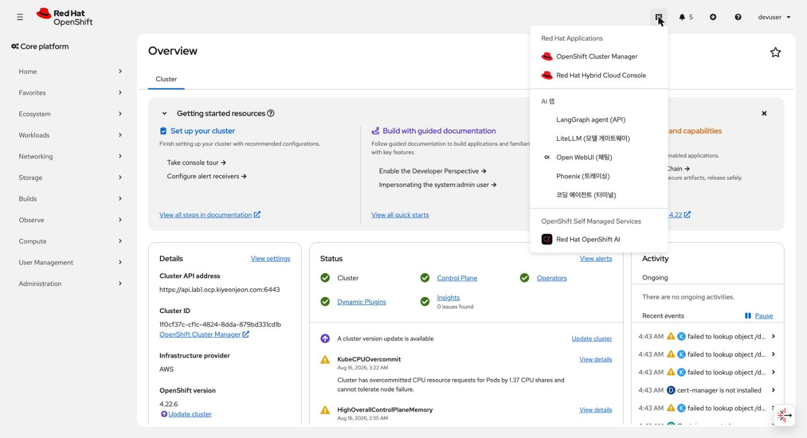
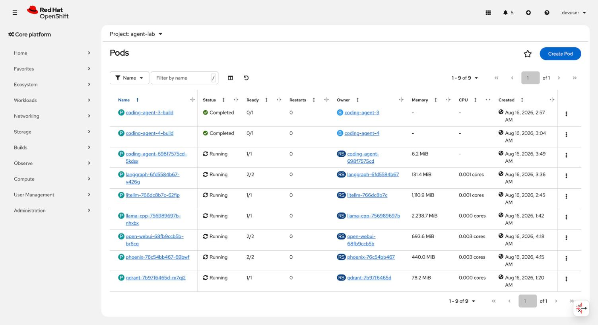
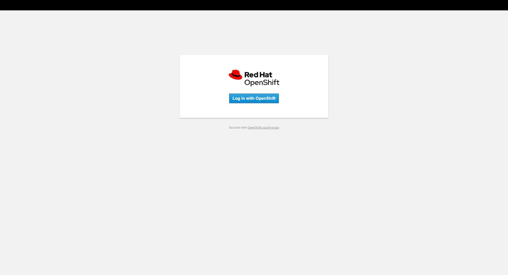
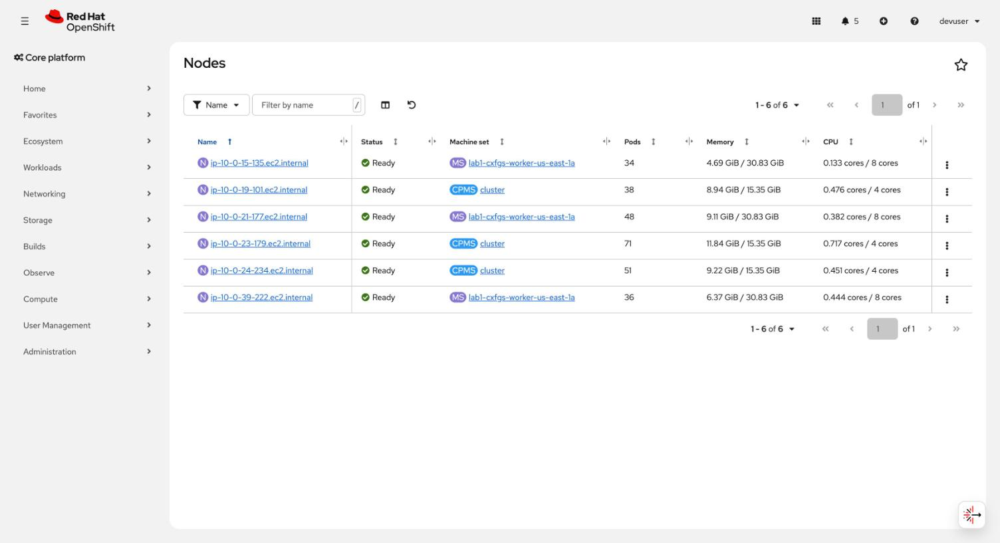
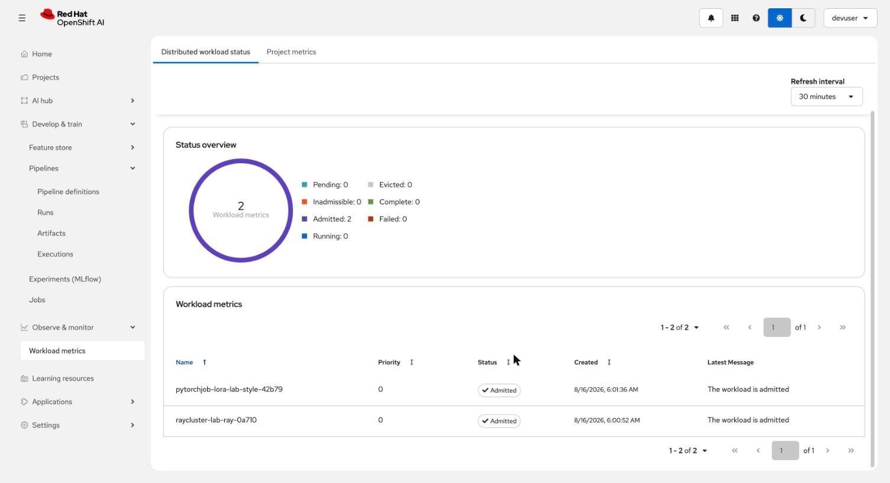

# 화면으로 보는 랩 가이드

이 폴더는 **실제로 떠 있는 클러스터를 브라우저로 찍은 스크린샷**과 그 설명입니다.

[README.md](../../README.md) 는 구조와 이유를 설명합니다.
여기는 "그래서 화면에서 무엇을 보게 되는가" 를 담습니다.
처음 따라 하는 사람이 각 단계 끝에서 자기 화면과 대조할 수 있게 하는 것이 목적입니다.

## 읽는 법

각 항목은 이렇게 구성됩니다.

- 확인 시점 - 어느 단계를 마친 뒤에 보는 화면인지
- 판정 기준 - 이 화면에서 눈으로 확인할 것
- 어긋나면 - 다를 때 어디를 보는지

## 세대가 바뀌면

스크린샷 안의 클러스터 도메인과 파드 이름은 **그 세대의 것**입니다.
재설치하면 `infraID` 가 바뀌고 파드 이름도 전부 바뀝니다.

바뀌는 값은 대조 대상이 아닙니다.
**화면의 구조와 상태 표시가 대조 대상입니다.**
`Running` 인지, 항목이 몇 개인지, 어떤 탭이 있는지를 보세요.

세대별 실제 ID 와 엔드포인트는 [docs/snapshots/](../snapshots/) 에 있습니다.
이 스냅샷들은 `lab1-cxfgs` 세대(OCP 4.22.6 / RHOAI 3.4.3)에서 찍었습니다.

---

## 1. 앱 런처 - 이 랩의 입구



확인 시점: `deploy-agent-stack.sh` 와 `70-console` 매니페스트 적용 후.

콘솔 오른쪽 위 격자 아이콘을 누르면 나옵니다.

이 화면에서 확인할 것들입니다.

- `AI 랩` 섹션이 있고 항목이 5개입니다.
  LangGraph agent / LiteLLM / Open WebUI / Phoenix / 코딩 에이전트
- 그 아래 `OpenShift Self Managed Services` 에 `Red Hat OpenShift AI` 가 있습니다.
  이건 우리가 만든 게 아니라 RHOAI 가 설치되면서 스스로 등록한 `rhodslink` 입니다.
- 오른쪽 위 사용자 이름이 `kube:admin` 이 아니라 `devuser` 입니다.
  IdP 가 붙었다는 뜻입니다.

**여기가 이 랩의 "홈 화면" 입니다.**
별도 포털을 만들지 않은 이유는 [consolelinks.yaml.tpl](../../manifests/70-console/consolelinks.yaml.tpl) 주석에 적어 두었습니다.

어긋나면: `oc get consolelink` 로 등록 여부를 봅니다.
브라우저 캐시 때문에 안 보일 때가 있어 새로고침을 한 번 하세요.

---

## 2. agent 스택 파드 - 사이드카가 눈에 보입니다



확인 시점: `deploy-agent-stack.sh` 이후. `verify-agent-stack.sh` 가 통과한 상태입니다.

이 화면에서 확인할 것들입니다.

Ready 열의 숫자가 이 랩의 SSO 설계를 그대로 보여 줍니다.

| 파드 | Ready | 왜 |
| --- | --- | --- |
| `langgraph` | **2/2** | 앱 + oauth-proxy |
| `open-webui` | **2/2** | 앱 + oauth-proxy |
| `phoenix` | **2/2** | 앱 + oauth-proxy |
| `litellm` | 1/1 | API 라 마스터 키로 지킵니다. oauth-proxy 를 붙이면 CLI 가 못 씁니다 |
| `llama-cpp` | 1/1 | 내부 전용. Route 없음 |
| `qdrant` | 1/1 | 내부 전용 |
| `coding-agent` | 1/1 | 웹 서버가 아닙니다. `oc rsh` 로 씁니다 |

`coding-agent-N-build` 가 `Completed` 로 남아 있는 것은 정상입니다.
이미지 빌드 기록이라 지워도 됩니다.

어긋나면: 2/2 여야 할 것이 1/1 이면 매니페스트를 다시 적용하지 않은 것입니다.
`rollout restart` 는 spec 을 바꾸지 않습니다.
`render-manifests.sh` 후 `oc apply` 까지 해야 합니다.

---

## 3. SSO 가 걸린 화면



확인 시점: Phoenix / Open WebUI / LangGraph 에 접속했을 때. 로그인 세션이 없으면 이게 먼저 나옵니다.

이 화면에서 확인할 것들입니다.

- `Log in with OpenShift` 버튼
- 아래에 작게 **`Secured with OpenShift oauth-proxy`**

이 두 줄이 "앱 앞에 인증이 걸렸다" 의 증거입니다.

Phoenix 는 원래 로그인 개념이 없는 도구입니다.
붙이기 전에는 인증 없이 이만큼 됐습니다.

```text
/            200
/graphql     200   트레이스 전문 조회
/v1/traces   200   트레이스 주입까지 가능
```

프롬프트와 응답 전문이 쌓이는 곳이라 그대로 두면 안 됩니다.

어긋나면: 이 화면 없이 앱이 바로 열리면 프록시를 안 거친 것입니다.
`verify-agent-stack.sh 5` 가 이걸 검사합니다.
반대로 로그인 후에도 403 이면 `system:auth-delegator` ClusterRoleBinding 이 없는 경우입니다.

---

## 4. 노드 - 무엇이 어디서 도는가



확인 시점: 아무 때나. GPU 를 올리기 전후로 비교하면 좋습니다.

이 화면에서 확인할 것들입니다.

- 노드 6개. 마스터 3 + 워커 3 입니다.
- `Machine set` 열이 출처를 말해 줍니다.
  `CPMS cluster` 는 컨트롤 플레인(ControlPlaneMachineSet),
  `MS lab1-...-worker-us-east-1a` 는 워커입니다.
- 워커는 8 cores / 30.83 GiB, 마스터는 4 cores / 15.35 GiB 입니다.
  `ai` 프로파일이 워커를 크게 잡은 결과입니다. RHOAI 대시보드가 이걸 요구합니다.
- 이름이 전부 `ip-10-0-*` 입니다. **프라이빗 서브넷의 사설 IP 입니다.**
  퍼블릭 IP 를 가진 노드가 하나도 없다는 뜻입니다.

**GPU 를 올리면** `lab1-...-gpu-us-east-1a` MachineSet 에서 노드가 하나 더 생깁니다.
지금 화면에 없는 이유는 `gpu-node.sh down` 으로 반납했기 때문입니다.

---

## 5. RHOAI 에서 학습 잡을 어디서 보나



확인 시점: `install-rhoai.sh distributed` 로 Kueue 배선을 마치고 학습이나 Ray 를 돌린 뒤.

**주소부터 다릅니다.**
RHOAI 3.4 의 대시보드는 `data-science-gateway` 를 통해 나갑니다.

```bash
oc get route -A | grep data-science-gateway
# openshift-ingress/data-science-gateway   rh-ai.apps.<cluster>.<domain>
```

예전 `rhods-dashboard-redhat-ods-applications.apps...` 도 살아 있지만 위가 정식입니다.

### 화면이 셋으로 나뉩니다

여기가 헷갈리는 지점입니다. 세 화면이 각각 다른 것을 봅니다.

| 화면 | 보는 대상 | 우리 워크로드가 뜨나 |
| --- | --- | --- |
| Develop & train > Pipelines | Kubeflow Pipelines | 안 뜹니다. iris 샘플만 |
| Develop & train > Jobs | **TrainJob, RayJob** | 안 뜹니다 (아래 설명) |
| Observe & monitor > **Workload metrics** | Kueue `Workload` | **여기 뜹니다** |

LoRA 학습은 파이프라인이 아니라 `PyTorchJob` 입니다. Pipelines 에 안 나오는 게 맞습니다.

Jobs 화면은 안내문에 그대로 적혀 있습니다.

```text
View and manage the progress of self-terminating jobs such as TrainJobs and RayJobs.
No TrainJobs or RayJobs have been found in this project.
```

우리가 만든 건 `PyTorchJob` 과 `RayCluster` 라 둘 다 이 목록에 없습니다.

- `TrainJob` 은 Kubeflow Trainer v2 의 CR 입니다. `trainer` 컴포넌트가 필요하고,
  그건 JobSet 오퍼레이터를 요구하는데 이 카탈로그에 없습니다. 확인해 보세요.

  ```bash
  oc get crd trainjobs.trainer.kubeflow.org   # 없음
  oc get crd rayjobs.ray.io                   # 있음
  ```

- `RayJob` 은 가능합니다. `RayCluster` 대신 `RayJob` 으로 만들면 이 화면에 뜹니다.

이 화면에서 확인할 것들입니다.

- `Status overview` 의 `Admitted` 숫자가 우리가 큐에 넣은 워크로드 수입니다.
- 목록의 이름은 원본 이름이 아니라 Kueue 가 만든 `Workload` 이름입니다.
  `pytorchjob-lora-lab-style-42b79` 처럼 `<종류>-<이름>-<해시>` 입니다.
- `Admitted` 는 **쿼터를 예약받았다**는 뜻이지 파드가 돈다는 뜻이 아닙니다.
  `Running: 0` 인데 `Admitted: 2` 인 상태가 정상적으로 있을 수 있습니다.

어긋나면: 아무것도 안 보이면 셋 중 하나입니다.

```bash
# 1. 네임스페이스가 Kueue 관리 대상인가
oc get ns <ns> -o jsonpath='{.metadata.labels.kueue\.openshift\.io/managed}'

# 2. Kueue 가 그 종류를 관리하도록 켜져 있나 (기본값은 BatchJob 하나뿐)
oc get kueues.kueue.openshift.io cluster -o jsonpath='{.spec.config.integrations.frameworks}'

# 3. 워크로드에 큐 라벨이 있나 (생성 시점에만 반영됩니다)
oc get pytorchjob <name> -n <ns> -o jsonpath='{.metadata.labels.kueue\.x-k8s\.io/queue-name}'
```

---

## 아직 못 찍은 화면

- **파이프라인 실행 그래프**: Pipelines > Runs 안에 있습니다. iris 샘플로 볼 수 있습니다.
- **콘솔 파드 터미널**: 처음 열면 검은 화면입니다. 콘솔 버그이고 `Expand` 를 누르면 나옵니다.
  자세한 것은 [README 트러블슈팅](../../README.md#트러블슈팅) 에 있습니다.

`*.apps` 는 브라우저에서 인증서 경고가 먼저 뜹니다.
클러스터 ingress CA 가 서명한 것이라 시스템 신뢰 저장소에 없습니다.
호스트마다 한 번씩 예외를 승인해야 합니다. `curl` 에 `-k` 가 필요한 것과 같은 이유입니다.
